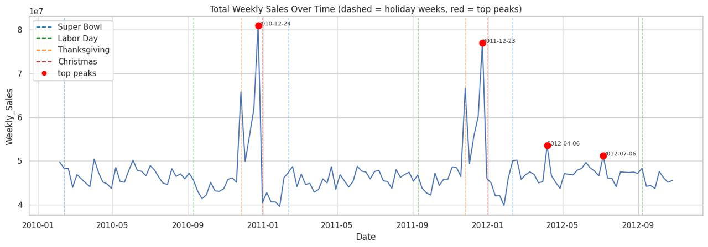
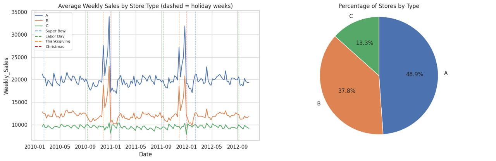
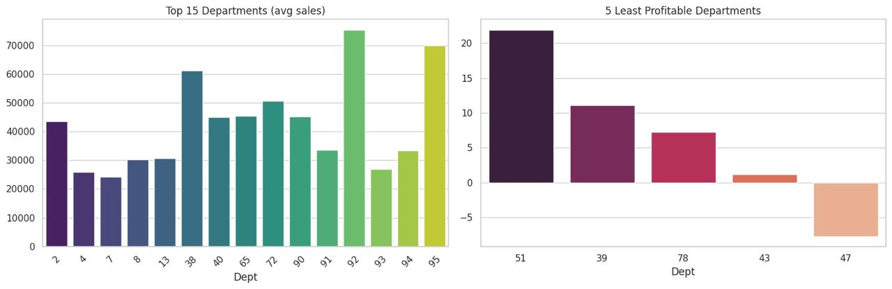
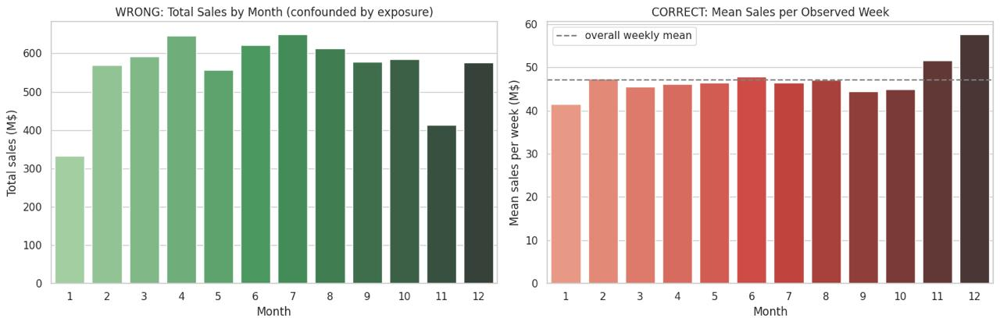
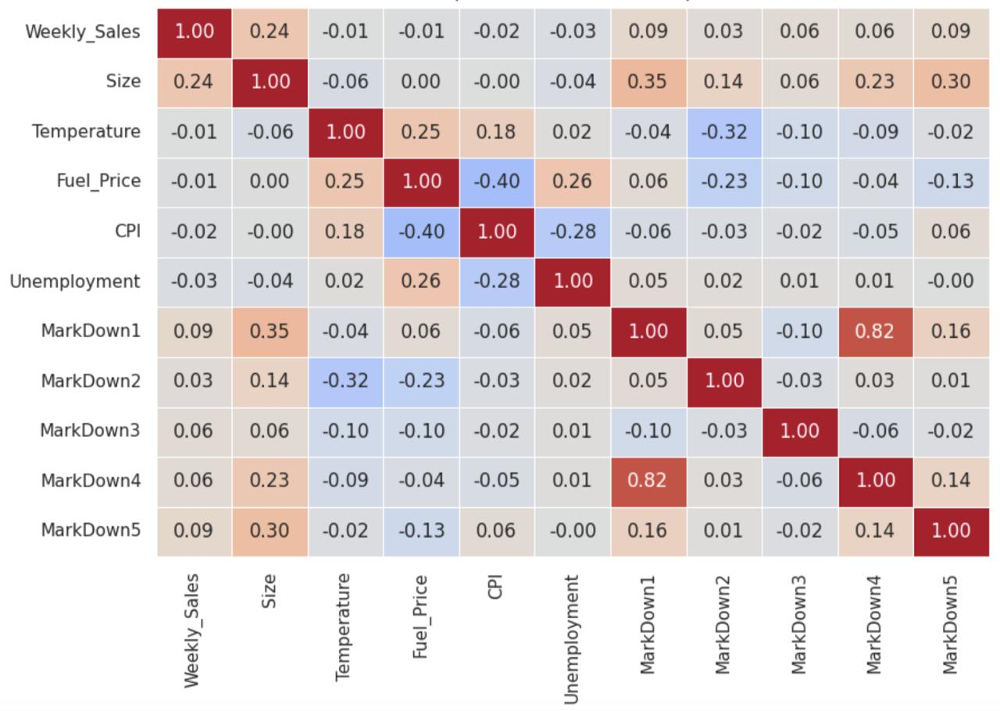
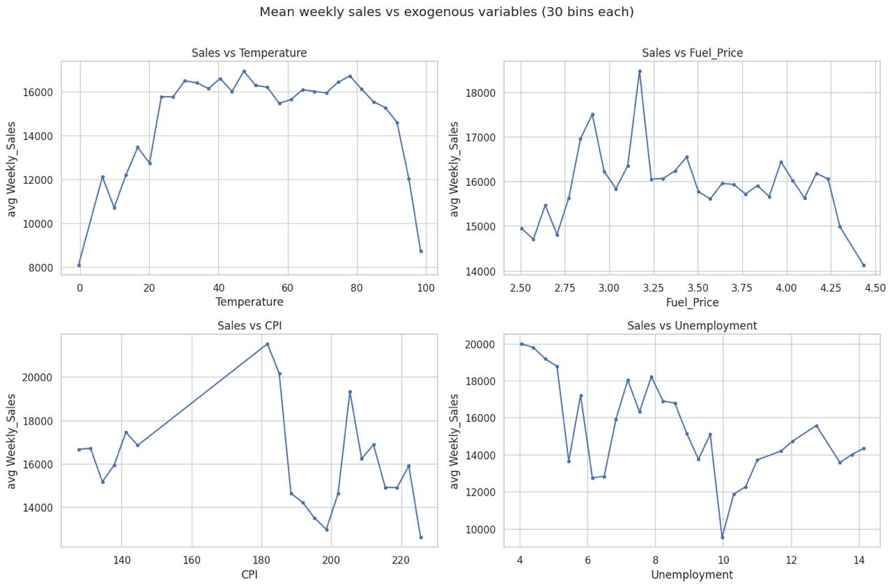
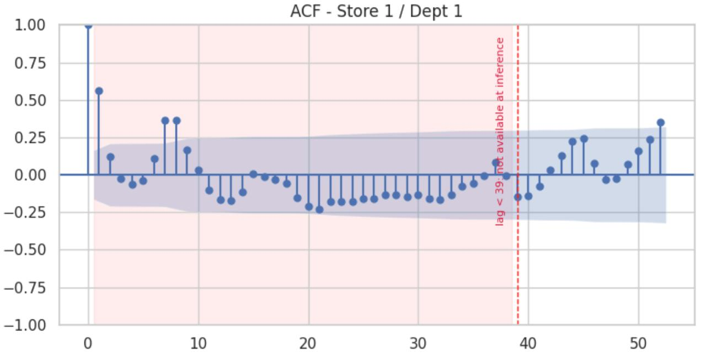
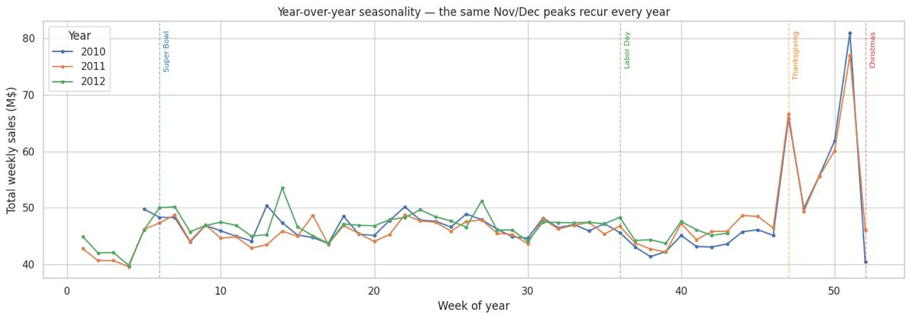

# Walmart Recruiting - Store Sales Forecasting

wandb: https://wandb.ai/toberi23-free-university-of-tbilisi-/Walmart-Recruiting-Store-Sales-Forecasting

## შეჯიბრების მიმოხილვა
შეჯიბრების მთავარი მიზანია გაყიდვების გამოცნობა. 
ამ შეჯიბრებაში მონაცემები შემდეგი ტიპისაა: გვაქვს სამი ძირითადი ფაილი- train.csv, features.csv, store.csv. 
გვაქვს 45 მაღაზია 81 დეპარტამენტით- ჯამში 3331 (მაღაზია;დეპარტამენტი) წყვილი (ანუ სერია). 
train.csv-ში თითოეული დატაფოინტი შეიცავს
ინფორმაციას მაღაზიაზე, დეპარტამენტზე, თარიღზე, კვირეულ გაყიდვებზე და ასევე იყო თუ არა ეს სადღესასწაულო
კვირა. features.csv-ში გვაქვს დამატებითი ინფორმაცია, რომელიც გაყიდვებთან პირდაპირ კავშირში არაა, 
თუმცა შესაძლოა, გავლენა იქონიოს გაყიდვებზე. ასეთი ცვლადებია, მაგალითად, ტემპერატურა, საწვავის ფასი, 
უმუშევრობა და ა.შ. store.csv-ში მოცემულია ინფორმაცია მაღაზიის ტიპსა და ზომაზე (სულ სამი ტიპის მაღაზიაა- A,B,C). 
უშუალოდ რა გავლენა აქვს თითოეულ ცვლადს გაყიდვებზე და აქვს თუ არა არსებითი 
მნიშვნელობა, EDA.ipynb-ში გვაქვს გარჩეული. ჩვენი მიზანია, დავაფრედიქტოთ მომავალი 39 კვირის გაყიდვები. 

ამოცანის შეფასების მეტრიკაა **WMAE** (Weighted Mean Absolute Error):
$$WMAE = \frac{\sum_i w_i |y_i - \hat{y}_i|}{\sum_i w_i}, \quad w_i = \begin{cases}5 & \text{IsHoliday} \\ 1 & \text{else}\end{cases}$$

ეს მეტრიკა დღესასწაულის კვირებს 5-ჯერ მეტ წონას ანიჭებს, რაც ნიშნავს იმას, რომ შეცდომები, დაშვებული
დღესასწაულის კვირებში გაცილებით ძვირადღირებულია მოდელისთვის. ეს შეფასების მეტრიკა განსაზღვრავს შემდგომში
პროექტის განმავლობაში მიღებულ თითოეულ გადაწყვეტილებას- მაგალითად, თუკი მოდელი საშუალოდ ნორმალურად 
აფრედიქტებს გაყიდვებს, მაგრამ ბევრ შეცდომას უშვებს დღესასწაულებთან მიმართებით, ბევრად 
ჩამოუვარდება იმ მოდელს, რომელიც საშუალოდ უარესია, მაგრამ საკმარისად ზუსტია დღესასწაულების კვირებთან
დაკავშირებით. 

## Exploratory Data Analysis (EDA)
train-ში დატაფოინტები მოცემულია შემდეგ თარიღებში:
2010-02-05 -> 2012-10-26, ხოლო ტესტში- 2012-11-02 -> 2013-07-26. როგორც ზემოთ აღვნიშნეთ, სულ 3331
სერიაა- ანუ (მაღაზია;დეპარტამენტი) წყვილი. 

უპირველეს ყოვლისა, დავაკვირდით სვეტებს NaN მნიშვნელობის შემცველობის მიხედვით. აღმოჩნდა, რომ 
Markdown სვეტები (რომელთა მნიშვნელობაზე ინფორმაციაც არ გვაქვს), თითქმის ცარიელია: 
1. MarkDown2       73.611025
2. MarkDown4       67.984676
3. MarkDown3       67.480845
4. MarkDown1       64.257181
5. MarkDown5       64.079038

თუმცა აქვე აღსანიშნავია ისიც, რომ markdown-ების შესახებ ინფორმაცია ხელმისაწვდომია მხოლოდ და მხოლოდ 
2011 წლის ნოემბრიდან. 

დავაკვირდეთ გაყიდვების ცვალებადობას დროში:

შევამჩნევთ, რომ ყოველკვირეული გაყიდვები 40-დან 50 
მილიონამდე მერყეობს თუმცა აღსანიშნავია, რომ გვაქვს პიკებიც. საინტერესოა, რომ ეს პიკები მაინცდამაინც 
დღესასწაულებს არ ემთხვევა- მაგალითად, მოცემულ დატაში ორი ყველაზე მაღალგაყიდვიანი კვირა შობის წინა 
პერიოდს ემთხვევა, ხოლო უშუალოდ შობის დროს გაყიდვები მკვეთრად ეცემა. ამის მიზეზი შემდეგში 
მდგომარეობს: მონაცემებში კვირა მთავრდება პარასკევ დღეს, ხოლო დღესასწაულის კვირად მონიშნულია ის, 
რომელიც უშუალოდ შეიცავს მას. შობის დღე ემთხვევა კვირის დასაწყისს, ამიტომ წინასაშობაო "შოპინგი", როგორც წესი, 
წინა კვირაზე მოდის (და არა უშუალოდ იმ კვირაზე, რომელშიცაა შობა).
ამის საწინააღმდეგოდ, მადლიერების დღესთან დაკავშირებით გაყიდვები პიკს აღწევს უშუალოდ 
იმ კვირაში და არა მის წინამდებარედ. 
რაც შეეხება დანარჩენ ორ დღესასწაულს, მათ მკვეთრი ზეგავლენა არ აქვთ გაყიდვებზე.

| Week | Total | IsHoliday | WMAE weight |
|---|---:|:---:|:---:|
| 2010-12-24 | 80.93M | False | 1 |
| 2011-12-23 | 77.00M | False | 1 |
| 2011-11-25 (Thanksgiving) | 66.59M | True | 5 |
| 2010-11-26 (Thanksgiving) | 65.82M | True | 5 |
| 2010-12-31 ("Christmas") | 40.43M | True | 5 |
| 2011-12-30 ("Christmas") | 46.04M | True | 5 |

რაც შეეხება მაღაზიის ტიპებს, A და B ტიპის მაღაზიებში კვირეული გაყიდვების გრაფებს 
შორის აშკარა მსგავსება შეინიშნება და, როგორც საერთო გრაფზე იყო,
საშობაო და მადლიერების დღის პიკები გამოკვეთილია, რასაც ვერ ვიტყვით C ტიპის მაღაზიებზე. ასევე, დაახლოებით
ნახევარი მაღაზიებისა A ტიპისაა, რაც განაპირობებს კიდეც იმას, რომ ყველაზე მაღალი კვირეული გაყიდვები ამ 
ტიპის მაღაზიებზე მოდის. 

აღსანიშნავია დეპარტამენტის გავლენაც გაყიდვებზე. მაგალითად, 92-ე დეპარტამენტის გაყიდვები საშუალოდ 75 
ათასს აღწევს, მაშინც, როცა 47-ე დეპარტამენტს ჯამურად უარყოფითი გაყიდვები აქვს (პროდუქტი უფრო მეტად 
ბრუნდება, ვიდრე იყიდება)

თუ დავაკვირდებით თვის ჯამურ გაყიდვებსა და თვის საშუალო გაყიდვებს, მათ შორის აშკარად შეიმჩნევა 
ლოგიკური უზუსტობა. თუკი დავაკვირდებით ამ ორ გრაფიკს, ვნახავთ, რომ, მაგალითად, აპრილსა და ივლისში ჯამურად
გაყიდვები 600 მილიონზე მეტს აღწევს, რაც ბევრად მეტია, ვიდრე ნოემბერ-დეკემბერში ჯამური გაყიდვები, თუმცა
საშუალოდ ნაკლებია, ვიდრე წელიწადის ბოლო ორ თვეში. ეს განპირობებულია იმით, რომ თრეინინგ დატაში 
ნოემბერ-დეკემბერი 2-2-ჯერ გვხვდება, ხოლო აპრილი-ივლისი-3-3-ჯერ, შესაბამისად, თვეების შესადარებლად 
უკთესი მეტრიკა საშუალო გაყიდვებია. 

ცვადებსა და კვირეულ გაყიდვებს შორის კორელაცია არ აღმოჩნდა ყურადსაღები. 
კორელაციის მატრიცაში ვხედავთ, რომ ერთადერთი მნიშვნელოვანი 
კავშირი გაყიდვებსა და მაღაზიის ზომას შორისაა, რაც საკმაოდ ინტუიციურია. 

(მაღაზია1;დეპარტამენტი1) სერიისთვის ავაგეთ ACF- Autocorrelation function. ACF(k)
გვიჩვენებს კორელაციას y_t-სა და y_{t-k}-ს შორის. თუ დავაკვირდებით გრაფს, შევამჩნევთ, რომ 
როდესაც ჩამორჩენა 52 კვირა ანუ 1 წელია, კორელაცია საკმაოდ მაღალია, რაც აჩენს ვარაუდს
კვირეული გაყიდვების სეზონურობაზე. 

ამის დასაზუსტებლად დავპლოტეთ სამივე წლის კვირის გაყიდვები ერთ გრაფზე, საიდანაც აშკარად ჩანს, 
რომ გაყიდვების გრაფები ერთმანეთს საკმაოდ ემთხვევა. შესაბამისად, ისეთი მოდელები, 
რომლებიც სეზონურობას ითვალისწინებს, ვივარაუდეთ, რომ უკეთეს შედეგს უნდა გვაძლევდეს. 

## ვალიდაცია

ამ პროექტში განსაკუთრებით მნიშვნელოვანია, დავაკვირდეთ _ტრეინ/ვალიდაციის გაყოფას_. 
უპირველეს ყოვლისა, ლოგიკურია, რომ ვალიდაციის დატა იყოს ერთი უწყვეტი დროის მონაკვეთი, 
თუმცა, იმის ნაცვლად, რომ ტრივიალურად ტრეინინგის რაიმე ბოლო მონაკვეთის ნაწილი ავიღოთ
ვალიდაციად, ავიღოთ ტესტ დატასეტის მონაკვეთის ერთი წლის წინანდელი პერიოდი. რადგანაც ტესტი
მოიცავს პერიოდს **2012-11-02 -> 2013-07-26**, ვალიდაციად ავიღებთ ამ დროის მონაკვეთთან 
მაქსიმალურად მსგავს ინტერვალს: **2011-11-04 → 2012-07-27**. 

## Feature Engineering 
1. **lag_39, lag_52, lag_104**- ესაა ახალი ცვლადები, რომლებიც გვიჩენებს (მაღაზია;დეპარტამენტი;კვირა)
სამეულისთვის, შესაბამისად, 39, 52, 104 კვირის წინ კვირეულ გაყიდვებს. ეს ცვლადი შემოვიღეთ მას შემდეგ, 
რაც დავაკვირდით ACF-ს;
2. **sd_woy_mean**- ეს ცვლადი გვიჩვენებს (მაღაზია;დეპარტამენტი;კვირა) სამეულისთვის საშუალო კვირეულ
გაყიდვებს, რაც ერთი წლის წინანდელ, შესაძლოა, ხმაურიან მონაცემებთან შედარებით უფრო ზუსტი 
მაჩვენებელია- რამდენიმე წლის გასაშუალოებით ხმაური "იკარგება";
3. **store_dept_mean**- (მაღაზია;დეპარტამენტი) წყვილის საშუალო კვირეული გაყიდვა (მთლიანი ტრეინინგ
დატის); 
4. **dept_type_mean**- (დეპარტამენტი;ტიპი) წყვილის საშუალო კვირეული გაყიდვა. ეს ცვლადი დავამატეთ
იმისთვის, რომ თუკი (მაღაზია;დეპარტამენტი), მაგალითად, ტესტში გვხვდება, ხოლო ტრეინში- არა, 
მაშინ ზემოჩამოთვლილი ცვლადები გამოუსადეგარია (არ არსებობს), ეს ცვლადი კი გარკვეული ინფორმაციის 
მატარებელი შეიძლება, იყოს;
5. **hist_len**- ერთი სერიისთვის ისტორიაში არსებული კვირების რაოდენობა. რაც უფრო ცოტაა ისტორიის ზომა, 
lag ცვლადები გაცილებით უფრო ხმაურიანია, ეს ცვლადი კი "გააკონტროლებს" მათ გავლენას და ნაკლებ
"წონას" მიანიჭებს მათ;
6. **month, weekofyear**- დროითი "პოზიციის" აღსაქმელად;
7. **თვის და კვირის სინუსური და კოსინუსური ენკოდირების ცვალდები**- განსხვავებით პირდაპირ 
თვისა და კვირის ცვლადებისგან, რომლებისთვისაც პირველი და მეთორმეტე თვეები გაცილებით დაშორებულია
ერთმანეთისგან, ვიდრე რეალურადაა, ეს ტრიგონომეტრიული ცვლადები ამ კავშირის ციკლურობის 
დაჭერაში გვეხმარება;
8. **დღესასწაულამდე დარჩენილი დღეები**- ეს ცვლადი შემოვიღეთ იმისთვის, რომ მოდელს შესძლებოდა, 
უკეთ აღექვა არა მხოლოდ ის, დღესასწაულია თუ არა ის კონკრეტული კვირა, არამედ დღესასწაულთან
მისი სიახლოვე აღექვა.

აქვე გვინდა, აღვნიშნოთ "ხრიკი", რომელიც შობას ეხება:

| Year | Split | Flagged week (`IsHoliday=True`) | Dec 25 is a | Pre-Christmas shopping days inside | Week ends |
|---|:---:|---|---|:---:|:---:|
| 2010 | train | Dec 25 – **Dec 31** | Saturday | **0** | +6d after Christmas |
| 2011 | train | Dec 24 – **Dec 30** | Sunday | **1** | +5d after Christmas |
| **2012** | **test** | Dec 22 – **Dec 28** | **Tuesday** | **3** | **+3d after Christmas** |

ტრეინინგ დატაში არსებული ორივე საშობაო დღესასწაულის კვირა თითქმის არ შეიცავს, როგორც უკვე ვნახეთ, 
შობის წინანდელ "საშოპინგო პიკს", თუმცა იგივე სიტუაცია არაა ტესტის მონაცემებში, შესაბამისად, მოდელი 
დაისწავლის კანონზომიერებას, რომელიც ვერ განზოგადდება და ტესტში "არ გამოადგება". ამისთვის დავამატეთ 
christmas shift, რომელიც "ხელოვნურად" გამოასწორებს მოდელის მიერ დასწავლილ არაზუსტ კანონზომიერებას და 
51-ე/52-ე კვირებს შორის უფრო ზუსტად გადაანაწილებს გაყიდვებს:
- კვირა 48 = 64.3% საკუთარი მნიშვნელობისა + 35.7% 52-ე კვირის მნიშვნელობისა                                                                                             
- კვირა 49 = 64.3% საკუთარი მნიშვნელობისა + 35.7% 52-ე კვირის მნიშვნელობისა                                                                                                                  
- კვირა 50 = 64.3% საკუთარი მნიშვნელობისა + 35.7% 52-ე კვირის მნიშვნელობისა                                                                                                                  
- კვირა 51 = 64.3% საკუთარი მნიშვნელობისა + 35.7% 52-ე კვირის მნიშვნელობისა                                                                                                                  
- კვირა 52 = 64.3% საკუთარი მნიშვნელობისა + 35.7% 52-ე კვირის მნიშვნელობისა

## Training 

## Prophet

### არქიტექტურა -  ახსნილი საფუძვლებიდან

Meta-ს მიერ შექმნილი Prophet ეფუძნება დაშვებას, რომ მრუდი შეიძლება დაიშალოს ერთმანეთთან შესაკრებ კომპონენტად და ჩვენთვის გასაგებ კომპონენტებად:

$$y(t) = g(t) + s(t) + h(t) + \sum_k \beta_k x_k(t) + \varepsilon(t)$$

მარტივად რომ ვთქვათ: **პროგნოზირებული გაყიდვები = ნელა ცვალებადი საერთო ტრენდი + განმეორებადი სეზონური რხევა + 
დღესასწაულებით გამოწვეული ზრდა ან შემცირება +
ჩვენ მიერ მიწოდებული დამატებითი სვეტების წრფივი გავლენა + 
დარჩენილი აუხსნელი ნაწილი ანუ ნოიზი.** 
თითოეული კომპონენტი შეიძლება ცალ-ცალკე აისახოს 
გრაფიკზე და გაანალიზდეს, რაც მნიშვნელოვანი უპირატესობაა იმის გასაგებად, *რატომ* აკეთებს მოდელი კონკრეტულ პროგნოზს.

* **`g(t)` - ტრენდი.** ნაწილობრივ *წრფივი* მრუდი -  
პრაქტიკულად სწორი ხაზი, რომელსაც დროის რამდენიმე წერტილში მიმართულების შეცვლა შეუძლია. 
ამ წერტილებს **changepoints** -  ეწოდება. 
`n_changepoints` განსაზღვრავს, რამდენი ასეთი წერტილი არსებობს; 
`changepoint_range` ზღუდავს მათ განთავსებას ისტორიის მხოლოდ პირველ X%-ში. 
სწავლების პერიოდის უშუალოდ ბოლოში მოთავსებული ცვლილების წერტილი ხშირად უბრალოდ ნოიზია და 
შეიძლება, პროგნოზი არასწორად გააკეთოს მომდევნო 39 კვირაზე. `changepoint_prior_scale` არის ტრენდის 
„მოქნილობის მარეგულირებელი“ -  მაღალი მნიშვნელობისას სეზონური პიკების უფრო მარტივად აღქმა შეგვიძლია.
* **`s(t)` -  სეზონურობა.** 
განმეორებადი წლიური რხევა, რომელიც **ფურიეს მწკრივის** საშუალებით აიგება. 
ნებისმიერი განმეორებადი, ტალღის მსგავსი ფორმა შეიძლება, მიახლოებით წარმოვადგინოთ 
სხვადასხვა სიხშირის რამდენიმე მარტივი სინუსისა და კოსინუსის ტალღის შეკრებით. 
ტალღების უფრო დიდი რაოდენობა -  `yearly_seasonality_order`, ანუ „ფურიეს რიგი“ -  მოდელს საშუალებას აძლევს უკეთ 
აღწეროს მკვეთრი პიკები, მაგალითად მადლიერების დღისა და შობის პერიოდში, 
თუმცა შეზღუდული ისტორიის მქონე სერიებზე ხმაურის დასწავლის შანსს ქმნის.
`seasonality_prior_scale` განსაზღვრავს, რამდენად დიდი შეიძლება იყოს სეზონური რხევის ამპლიტუდა.
* **`h(t)` -  დღესასწაულები.** რადგან მადლიერების დღისა და შობის ეფექტები მკვეთრი,
ერთკვირიანი პიკებია და არა გლუვი რხევები, Prophet-ს კონკრეტული თარიღების ცალკე ცხრილს გადავცემთ. 
თითოეული თარიღის გარშემო, სურვილისამებრ, შეიძლება, დღეების ფანჯარაც განისაზღვროს. 
მოდელი თითოეული დღესასწაულისთვის თითოეულის ეფექტის ზომას სწავლობს, რის რეგულარიზაციასაც `holidays_prior_scale` აკონტროლებს.
* **დამატებითი რეგრესორები**, მაგალითად, `Temperature`, 
ერთგვარი **წრფივი შესწორებაა**. Prophet-ს მათი არაწრფივი დამოკიდებულების სწავლა არ შეუძლია, რაც ნაწილობრივ პრობლემაა, 
რადგან EDA-ში ვნახეთ, რომ მონაცემების უდიდეს უმრავლესობას მკაფიოდ გამოხატული დამოკიდებულება გაყიდვებზე არ ჰქონია. 
* **`seasonality_mode`** (`additive` ან `multiplicative`) განსაზღვრავს, 
სეზონური და სადღესასწაულო ეფექტები ფიქსირებული დოლარული თანხით დაემატება პროგნოზს (`additive`) 
თუ ტრენდის დონის პროცენტული წილი იქნება (`multiplicative`). 
პატარა მაღაზია შეიძლება, კვირაში $10k-ს ყიდდეს, ხოლო დიდი -  $100k-ს.
ასეთ შემთხვევაში ფიქსირებული დოლარული Christmas-ის ზრდა ერთისთვის ზედმეტად დიდი, მეორისთვის კი ზედმეტად მცირე იქნება.
`multiplicative` რეჟიმი ერთგვარად ანორმალიზებს ეფექტებს, რაც ამ შეჯიბრებისთვის, ვფიქრობთ, ლოგიკური ჩანს, 
რადგან გაყიდვები ძლიერად არის დაკავშირებული მაღაზიის ზომასთან (EDA-ში ვნახეთ).

მოდელის მთავარი შეზღუდვა ისაა, რომ
ის **თითოეულ სერიაზე ცალ-ცალკე** მუშაობს -  ყოველი `(Store, Dept)` 
წყვილი საკუთარ დამოუკიდებელ მოდელს იღებს და სხვა სერიების შესახებ საერთოდ არ აქვს ინფორმაცია. 
ამიტომ Prophet ვერ იყენებს იმ ფაქტს, რომ ხშირად დეპარტამენტების გაყიდვები ძალიან ჰგავს ერთმანეთს.

### DataCleaner

NaN-ების შევსების მექანიზმი:

* `MarkDown1-5` → ივსება `0`-ით. ეს სვეტები 2011-11-11-მდე სტრუქტურულად არ არსებობს. 
* `CPI`, `Unemployment` → ივსება **მხოლოდ train მონაცემებიდან** გამოთვლილი მედიანით. 

### HolidayFeatureEngineer

* **დღესასწაულების ცხრილი** აგებულია ზუსტ კალენდარულ თარიღებზე და არა `IsHoliday` ბულეანზე. 
როგორც ვნახეთ, შობის კვირა რეალურ დღესასწაულთან მიმართებით იცვლება იმის მიხედვით, 
თუ კვირის რომელ დღეს ემთხვევა 25 დეკემბერი. ზოგ წელს მონიშნული კვირა წინასაშობაო
სავაჭრო აქტივობის უმეტეს ნაწილს მოიცავს, ზოგ წელს კი თითქმის ვერაფერს. 
რეალური კალენდარული თარიღისა და `[lower_window=-3, upper_window=1]` ფანჯრის გამოყენება უზრუნველყოფს, 
რომ მოდელმა ინტენსიური წინასადღესასწაულო სავაჭრო დღეები ყოველთვის ერთი და იმავე სადღესასწაულო ეფექტის ნაწილად აღიქვას,
მიუხედავად იმისა, კვირის რომელ დღეს ემთხვევა დღესასწაული კონკრეტულ წელს.

### RegressorSelector 

`RegressorSelector` კვირეული გაყიდვებისა და ცვლადების კორელაციას ამოწმებს და ამის მიხედვით ტოვებს/არ ტოვებს მათ.

`MarkDown1-5` სვეტები წავშალეთ, რადგან დატაფოინტების თითქმის 2/3-ში მათი მნიშვნელობა არ გვაქვს და ისინი პრაქტიკულად მუდმივებია. 

დავტოვეთ შემდეგი ცვლადები: `IsHoliday`, `Temperature`, `Fuel_Price`, `CPI`, `Unemployment`.

### `SeasonalNaiveFallback`, `ProphetSeriesModel`, `ProphetForecastPipeline`

**Fallback-ის პრობლემა.** 
ძალიან მოკლე ისტორიის შემთხვევაში მოდელს შეიძლება, მაგალითად, დეკემბერი საერთოდ არ ჰქონდეს „ნანახი“ და ვერც დაისწავლოს კანონზომიერება.

`SeasonalNaiveFallback` მუშაობს "მოკლე" სერიებზე (ასეთი 340 ცალია)
შესაძლებლობის შემთხვევაში პროგნოზად ვიყენებთ „იმავე კვირას 52 კვირის წინ“.
თუ ეს შეუძლებელია, გადავდივართ კონკრეტული სერიის საშუალო მნიშვნელობაზე, საბოლოოდ კი - 
ყველა სერიის გლობალურ საშუალოზე.

`ProphetSeriesModel` ერთ `(Store, Dept)` სერიაზე მუშაობს და 
`SeasonalNaiveFallback.is_needed(...)` მეთოდის საშუალებით წყვეტს, რეალურად მოარგოს Prophet თუ fallback გამოიყენოს.

`ProphetForecastPipeline` აერთიანებს შემდეგ კომპონენტებს:

`DataCleaner` → `HolidayFeatureEngineer` → `RegressorSelector` → თითოეული სერიისთვის ერთი `ProphetSeriesModel`

თითოეულ sweep-ს ვაკეთებთ **150 სერიაზე** (ჩქარა რომ გავტესტოთ ჰიპერპარამეტრები). 
ოთხ ჯგუფად დავყავით სერიები საშუალო გაყიდვების მიხედვით და თითოეული ჯგუფიდან თანაბარარი რაოდენობით ავირჩიეთ სერიები.

გამარჯვებულ კონფიგურაციას ხელახლა ვაფასებთ **ყველა** სერიაზე, რათა საბოლოო შედეგი მივიღოთ.

**განხილული ჰიპერპარამეტრების სრული ცხრილი:**

| ჰიპერპარამეტრი                              | კანდიდატი მნიშვნელობები              | რას აკონტროლებს                                                                                           |
|---------------------------------------------|--------------------------------------|-----------------------------------------------------------------------------------------------------------|
| `changepoint_prior_scale`                   | `0.001, 0.01, 0.05, 0.1, 0.5, 1.0`   | ტრენდის მოქნილობა                                                                                         |
| `seasonality_prior_scale`                   | `0.1, 1.0, 10.0, 20.0`               | წლიური სეზონურობის ფურიეს კოეფიციენტების რეგულარიზაცია                                                    |
| `holidays_prior_scale`                      | `1.0, 10.0, 20.0`                    | სადღესასწაულო ფანჯრების კოეფიციენტების რეგულარიზაცია                                                      |
| `seasonality_mode`                          | `additive, multiplicative`           | ადიტიური ან მულტიპლიკაციური სეზონური და სადღესასწაულო ეფექტები                                            |
| `changepoint_range`                         | `0.8, 0.9, 0.95`                     | ისტორიის წილი, რომელშიც ცვლილების წერტილებია დაშვებული                                                    |
| `n_changepoints`                            | `15, 25, 50`                         | ცვლილების წერტილების კანდიდატთა რაოდენობა                                                                 |
| `yearly_seasonality_order` -  ფურიეს რიგი   | `5, 10, 20`                          | წლიური სეზონური მრუდის სიმკვეთრე                                                                          |
| `use_regressors`                            | `True, False`                        | დაემატება თუ არა `Temperature`/`Fuel_Price`/`CPI`/`Unemployment`/`IsHoliday` დამატებით წრფივ რეგრესორებად |

baseline - **2919.22** 

| ეტაპი                                              | გამარჯვებული                    |                                 ნიმუშის WMAE | დასკვნა                                                                                                                                                                                              |
| -------------------------------------------------- | ------------------------------- | -------------------------------------------: |------------------------------------------------------------------------------------------------------------------------------------------------------------------------------------------------------|
| `changepoint_prior_scale` (`0.001–1.0`)            | `0.05` -  Prophet-ის default     |                   2919.22 -  baseline-ის ტოლი | default მნიშვნელობა უკვე ოპტიმალური იყო                                                                                                                                                              |
| `seasonality_mode` (`additive`/`multiplicative`)   | `additive` -  Prophet-ის default |                   2919.22 -  baseline-ის ტოლი | tuning-ის ამ ეტაპზე ადიტიური მოდელი სადღესასწაულო ზრდას უკვე საკმარისად კარგად აღწერს და მულტიპლიკატიური უკვე ზედმეტია.                                                                              |
| `seasonality_prior_scale` / `holidays_prior_scale` | `0.1` / `1.0`                   |  2840.96 -  baseline-თან შედარებით **−78.26** | თუმცა გამარჯვებული აღმოჩნდა *უფრო მკაცრი* რეგულარიზაცია.                                                                                                                                             |
| `changepoint_range` / `n_changepoints`             | `0.95` / `15`                   |       2838.49 -  წინა ეტაპთან შედარებით −2.47 | ეფექტი მცირე აღმოჩნდა                                                                                                                                                                                |
| `yearly_seasonality_order` -  ფურიეს რიგი           | `20`                            | 2479.37 -  წინა ეტაპთან შედარებით **−359.12** | რომ 47-ე და 52-ე კვირების მკვეთრი პიკების აღსაწერად მაღალი რიგის ფურიეს მრუდია საჭირო.                                                                                                               |
| `use_regressors`                                   | `False`                         | 1871.84 -  წინა ეტაპთან შედარებით **−607.53** | `Temperature`/`Fuel_Price`/`CPI`/`Unemployment`/`IsHoliday` რეგრესორების ამოღებამ ყველა ეტაპს შორის ყველაზე დიდი გაუმჯობესება მოიტანა. სუსტი რეგრესორები (კორელაცია 0.1-ზე ნაკლებია) ამატებდა ხმაურს |

**ჰიპერპარამეტრების sweep-ის შემდეგ მიღებული კონფიგურაცია:**

`changepoint_prior_scale=0.05, seasonality_prior_scale=0.1, holidays_prior_scale=1.0, seasonality_mode="additive", changepoint_range=0.95, n_changepoints=15, yearly_seasonality_order=20, use_regressors=False`

კონფიგურაცია შეფასდა **3,331-ივე სერიაზე** და მიღებული შედეგია:

**WMAE = 2138.00**

ეს შედეგი *უარესია*, ვიდრე 150-სერიან ნიმუშზე მიღებული 1871.84, რაც მოსალოდნელიცაა. მცირე დატას უფრო კარგად "იზეპირებს".

| Submission                                          | Public შედეგი | Private შედეგი |
| --------------------------------------------------- | ------------: | -------------: |
| გადაწევის გარეშე (`use_christmas_shift=False`)      |          2706 |           2789 |
| **გადაწევით (`use_christmas_shift=True`, საბოლოო)** |      **2583** |       **2630** |

ჩვენმა "ხრიკმა" აქ კარგად იმუშავა. 

## LightGBM

### არქიტექტურა

LightGBM არის გრადიენტ ბუსტინგზე დაფუძნებული ხეების ანსამბლი.

**Boosting** ერთმანეთის შემდეგ ქმნის მრავალ მცირე, სუსტ ხეს. 
ყოველი ახალი ხე ერგება არა საწყის target-ს, 
არამედ წინა ხეების მიერ დაშვებულ *შეცდომას* და დაისწავლის residual-ებს. 
`n_estimators` განსაზღვრავს ხეების რაოდენობას, 
`learning_rate` კი — თითოეული ხის გაუმჯობესების რა ნაწილი დაემატება საერთო შედეგს.

LightGBM ხეებს ზრდის **leaf-wise** წესით:
ყოველ ეტაპზე ყოფს იმ ერთ ფოთოლს,
რომლის გაყოფაც შეცდომას ყველაზე მეტად ამცირებს, 
სიღრმის მიუხედავად. ეს განსხვავდება ძველი level-wise მიდგომისგან, რომელიც ლექციაზე გავარჩიეთ (იქ დაბალანსებული ხეები იყო). 
ასევე გამოიყენება **ჰისტოგრამებზე დაფუძნებული გაყოფა** — 
შესაძლო ზღვრების განხილვამდე მნიშვნელობები bin-ებად ჯგუფდება. 
ამ ორი მექანიზმის წყალობით LightGBM ასიათასობით მწკრივზე ერთ მოდელს რამდენიმე წამში ატრენინგებს.

`num_leaves` — დაშვებული ფოთლების საერთო რაოდენობა — და `max_depth` —  სიღრმის ზღვარი — 
მოდელის სირთულის ძირითადი მარეგულირებლებია. 
`min_child_samples`, `colsample_bytree`/`subsample` —
თითო ხისთვის მხოლოდ ქვესიმრავლის ჩვენება  — 
და `reg_alpha`/`reg_lambda` — L1/L2 ჯარიმები — 
რეგულარიზაციის პარამეტრებია. 

**Prophet-სა და ARIMA/SARIMA-სგან ყველაზე მნიშვნელოვანი სტრუქტურული განსხვავება:** ის სამი მიდგომა თითო `(Store, Dept)` 
მწკრივზე დამოუკიდებელ მოდელს აწყობს — სულ 3,331 მოდელს. 
LightGBM კი **ყველა მწკრივზე ერთიან, ერთ მოდელს** ატრენინგებს და `Store`, `Dept`, `Type` 
ჩვეულებრივ კატეგორიულ input სვეტებად მიეწოდება. შესაბამისად ამ მოდელს შეუძლია კავშირების დაჭერა, მაგალითად, სხვადასხვა 
დეპარტამენტებს შორის.

LightGBM-ს ასევე აქვს მექანიზმი, რომელიც კლასიკურ მოდელებს არ გააჩნია: 
`sample_weight`. ის training loss-ში დღესასწაულის მწკრივებს ხუთმაგ წონას ანიჭებს და პირდაპირ იმეორებს WMAE-ს შეფასების წესს. 
ქვემოთ ეს ცალკე მოწმდება როგორც `use_sample_weight`.

### `DataCleaner`

აქაც გვხვდება Prophet/ARIMA/SARIMA-ს მსგავსი ორი missing-value პრობლემა — `MarkDown1-5` და `CPI`/`Unemployment`,
თუმცა `CPI`/`Unemployment` უკეთესი წესით მუშავდება: გამოიყენება **თითო store-ზე forward-fill**, 
ანუ ბოლო ცნობილი მნიშვნელობა წინ მიგვაქვს, 
ხოლო სარეზერვო fallback-ად (თუ არაა წინა მნიშვნელობა)- მედიანას სერიის მიხედვით.

ნოუთბუქი ასევე ამატებს ახალ ნიშანს, რომელიც სხვა მოდელებს არ დასჭირვებიათ: **`markdown_recorded`** — 
ბულეან flag-ს, რომელიც აღნიშნავს, მიეკუთვნება თუ არა row იმ პერიოდს, 
როცა markdown-ების აღრიცხვა რეალურად მიმდინარეობდა (ანუ 2011-10-28-მდე).

ეს საჭიროა, რადგან `MarkDown` missingness train-სა და test-ს შორის *შებრუნებულია*: 
train-ში 2/3 გამოტოვებულია, test-ში კი თითქმის ყოველთვის არსებობს.
Flag ხეს საშუალებას აძლევს ცალკე split-ით ისწავლოს „ამ სვეტს flag-ის ჩართვამდე ნუ ენდობი“.

### `TimeSeriesFeatureEngineer`

დაემატა შემდეგი ცვლადები:

- **`lag_39`, `lag_52`, `lag_104`** 
- **`store_dept_mean`, `sd_woy_mean`, `dept_type_mean`** 
- **`hist_len`** 
- **`month`, `weekofyear`, `days_to_thanksgiving`, `days_to_christmas`, `days_to_superbowl`** 

### `FeatureSelector`

Prophet-ის მსგავსი "წრფივი" კორელაციის გამოყენება აქ არასწორი იქნებოდა. 
LightGBM-ს შეუძლია ზღვარზე split და მრუდე/არამონოტონური დამოკიდებულების დასწავლა — რაც ვნახეთ კიდეც EDA-ში.

`FeatureSelector` ამის ნაცვლად მცირე სეტზე LightGBM-ს ავარჯიშებს და ყველა კანდიდატს რეალური `feature_importances_`-ის მიხედვით ალაგებს.

**რეალური შედეგი:** დომინირებს `sd_woy_mean` — 1988 — და `lag_52` — 1197; 
შემდეგ მოდის `Dept` — 887, `Store` — 757, და `weekofyear` — 523. ვრწმუნებით, რომ ძირითადი სიგნალი სეზონურია.

27 კანდიდატიდან ზუსტად **7-ს ჰქონდა ნულოვანი მნიშვნელობა**:

- `lag_104`;
- `MarkDown1-5`-ის ყველა სვეტი;
- `markdown_recorded`.

`IsHoliday`, `Temperature`, `Fuel_Price`, `CPI` და `Unemployment` ყველა რეალურ, არანულოვან მნიშვნელობას ატარებდა.

### `LGBMForecastPipeline`

W&B-ში დაილოგა როგორც `LightGBM_Training_Baseline`, `LightGBM_Training_Sweep_*` და `LightGBM_Training_Final` run-ები.

ყველა ქვემოთ მოცემული კონფიგურაცია პირდაპირ სრულ `cv_train`/`cv_val` fold-ზე შეფასდა.

**ჰიპერპარამეტრების grid; baseline WMAE = 2250.53:**

| ეტაპი | კანდიდატი მნიშვნელობები | გამარჯვებული | WMAE | დასკვნა                                                                                                                                                                                       |
|---|---|---|---:|-----------------------------------------------------------------------------------------------------------------------------------------------------------------------------------------------|
| `num_leaves` | `15, 31, 63, 127, 255` | `15` | 2233.79 | ყველაზე მცირე კანდიდატმა გაიმარჯვა, იმიტომ, რომ ოვერფიტინგს ხელი შევუშალეთ; `255` ყველაზე ცუდი იყო — 2382.76 — სხვაობა 149 ქულა.                                                              |
| `max_depth` | `-1, 4, 6, 8, 10` | `-1` — default | 2233.79 | მას შემდეგ, რაც `num_leaves` უკვე ზღუდავდა სირთულეს, ყველა მკაცრი depth cap ოდნავ უარესი იყო.                                                                                                 |
| `learning_rate`, `n_estimators=3000` და early stopping | `0.005, 0.01, 0.03, 0.05, 0.1` | `0.05` | 2199.39 | არსებობს რეალური ოპტიმუმის წერტილი და უფრო ღრმა ხე უკეთესს არ ნიშნავს.                                                                                                                        |
| `min_child_samples` | `5, 10, 20, 50, 100` | `20` — default | 2199.39 | `5` ყველაზე ცუდი იყო, 2233.83, რაც მოკლე სერიების overfitting რისკს შეესაბამება                                                                                                   |
| `colsample_bytree × subsample` | თითოეული: `0.6, 0.8, 1.0` | `0.6 × 1.0` | 2113.38 | თითო ხისთვის სვეტების 40%-ის დამალვამ შედეგი 86 ქულით გააუმჯობესა.                                                                                                                            |
| `reg_alpha` — L1 × `reg_lambda` — L2 | თითოეული: `0, 0.1, 1.0` | `1.0 × 0.0` | 2113.38 | მხოლოდ L1-მა უკეთესი ქულა დადო                                                                                                                                                                |
| `objective` | `regression, regression_l1, huber` | `regression` — default | 2113.38 |                                                                                                                                                                                               |
| `use_sample_weight` | `True, False` | `False` | 2113.38 | დღესასწაულის row-ების ხუთმაგმა წონამ WMAE ოდნავ გააუარესა, 2131.78-მდე. მოდელს უკვე აქვს პირდაპირი კალენდარული ნიშნები, ამიტომ reweighting ძირითადად ვარიაციას ზრდის და არა ახალ ინფორმაციას. |
| `use_exogenous` | `True, False` | `True` | 2113.38 | exogenous block-ის მოცილებამ შედეგი ოდნავ გააუარესა — 2125.19. LightGBM-ს შეუძლია threshold split და არ არის იძულებული, დამოკიდებულება წრფივად წარმოადგინოს.                                  |

**საბოლოო შერჩეული კონფიგურაცია:** `num_leaves=15, max_depth=-1, learning_rate=0.05, n_estimators=3000` — early stopping-ით რეალურად 343 ხე — `min_child_samples=20, colsample_bytree=0.6, subsample=1.0, reg_alpha=1.0, reg_lambda=0.0, objective="regression", use_sample_weight=False, use_exogenous=True`.

**საბოლოო CV WMAE — fold B, სრული მონაცემები: 2113.38.** 

ამ sweep-ის ორი ყველაზე მკაფიო გაუმჯობესება ორივე **რეგულარიზაციიდან** მოვიდა — `num_leaves=15` და `colsample_bytree=0.6` — 
ანუ საწყისად ზედმეტად მოქნილი (ოვერფიტინგის უფრო მაღალი რისკის მქონე)
მოდელის შეკავებიდან და არა ახალი სიგნალის დამატებიდან.

### საშობაო კვირის ციკლური გადაწევა

| Submission | Public score | Private score |
|---|---:|---:|
| LightGBM, shift-ის გარეშე | 3042 | 3176 |
| LightGBM, **shift-ით** | **2723** | **2807** |

---

## N-BEATS

### არქიტექტურა

N-BEATS — Neural Basis Expansion Analysis for Time Series — არის **autoregressive deep learning მოდელი**. 
Prophet-ისა და LightGBM-ისგან განსხვავებით, მას **არც ერთი engineered feature-ს არ ვაძლევთ**: 
არ აქვს `Store`/`Dept` კატეგორიები, lag features, `CPI`, `Unemployment` ან markdown-ები.

ერთადერთი input არის თითოეული series-ის ბოლო `Weekly_Sales` მნიშვნელობების window — **backcast** — 
და მოდელი სწავლობს მის გარდაქმნას შემდეგი `HORIZON=39` კვირის **forecast**-ად. 
LightGBM-ის მსგავსად, ეს არის **ერთი global model**, რომელსაც ყველა 3,331 series იზიარებს, და არა 
Prophet-ის მსგავსი ერთი მოდელი თითო series-ზე.

ქსელი შედგება მცირე, ერთნაირი **block-ების stack-ისგან**. თითო block იღებს მიმდინარე residual signal-ს, ატარებს მცირე MLP-ში და ორ output-ს ქმნის:

- **backcast** — input-ის ის ნაწილი, რომელსაც block ხსნის;
- **forecast** — საბოლოო პროგნოზში ამ block-ის წვლილი.

თითო block-ის backcast residual-ს *აკლდება* შემდეგ block-ზე გადაცემამდე. 
ეს არის „doubly residual“ სტრუქტურა: ყოველ block-ს მხოლოდ ის ნაწილი აქვს ასახსნელი, 
რაც წინა block-ებმა ვერ ახსნა. ყველა block-ის forecast საბოლოო output-ში ჯამდება.

### Data Cleaning და window-ების აგება — `SeriesBuilder`, `WindowGenerator`

- **`SeriesBuilder`** გრძელ `(Store, Dept, Date, Weekly_Sales)` ცხრილს თითო series-ზე ერთ უწყვეტ, 
gap-free weekly array-ად გარდაქმნის: reindex `W-FRI`-ზე,
linear interpolation და non-negative clipping. 
ასევე ინახება per-series `(mean, std)`, რათა იმ სერიის ყველა ფანჯარა ერთნაირად ნორმალიზდეს- თუ სხვადასხვა სერიას
სხვადასხვა საშუალო/ვარიაცია აქვთ, nbeats მოდელს გაუჭირდება კანონზომიერებების დასწავლა, რადგან ზედმეტად არასტაბილური 
იქნება. 
- **`WindowGenerator`** თითო series-ზე `(backcast=52, forecast=39)` წყვილს `stride=3`-ით აცურებს და 
forecast window-ის თითო პოზიციას tag-ს აძლევს, არის თუ არა შესაბამისი თარიღი holiday week — 
ქვემოთ training-loss weighting-ისთვის.
- **`NBeatsNet`**: 3 generic block, `hidden_size=256`, თითო block-ის MLP-ში `num_layers=4`, `dropout=0.1`.

### Training- ჰიპერპარამეტრების ძიება Optuna-თი

ვცადეთ, გაგვეკეთებინა `optuna.TPESampler` joint search-ის 8 ჰიპერპარამეტრზე:

- `num_blocks`;
- `hidden_size`;
- `num_layers`;
- `dropout`;
- `learning_rate`;
- `weight_decay`;
- `batch_size`;
- `holiday_weight`.

**შედეგი:** trial 0 — ძველი hand-picked default — honest CV WMAE 3324.93. Trial #101-მა უკეთესი config იპოვა — **3295.12**, დაახლოებით 1%-იანი გაუმჯობესება.

| ჰიპერპარამეტრი | ძველი default | Optuna best — trial #101 |
|---|---:|---:|
| `num_blocks` | 3 | 3 |
| `hidden_size` | 256 | 128 |
| `num_layers` | 4 | 2 |
| `dropout` | 0.1 | 0.247 |
| `learning_rate` | 1e-3 | 5.65e-3 |
| `weight_decay` | 0.0 | 1.89e-4 |
| `batch_size` | 256 | 256 |
| `holiday_weight` | 5.0 | 4.74 |

გამარჯვებული config რეალურად უფრო **პატარაა** — ნაკლები layer და მცირე hidden size — მაგრამ უფრო მაღალი learning rate და მნიშვნელოვანი dropout აქვს.

**Kaggle საბმიშენი: Private 3288 / Public 3185**

საკმაოდ ცუდი შედეგი დადო. 

---